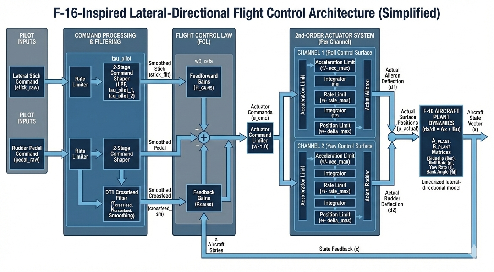

# F-16-Inspired Lateral-Directional Flight Control System (Simplified)


A simplified, F-16-inspired lateral-directional flight control system simulation
with command shaping, state feedback, and second-order actuator dynamics.

## System Architecture



## Continuous Integration

This project uses **GitHub Actions** for continuous integration.

On every push and pull request, the CI pipeline:
- installs dependencies
- runs unit tests
- executes a short simulation
- uploads generated plots as build artifacts

This ensures the control architecture, actuator model, and simulation remain functional across Python versions.

## Running the simulation

```bash
python scripts/run_demo.py


