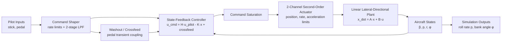

# F-16-Inspired Lateral-Directional Flight Control Simulation


[](https://github.com/hunkarsuci/F16-Inspired-Lateral-Directional-FCS/releases)

A simplified Python-based lateral-directional flight-control simulation inspired by F-16 flight-control architecture.

The project demonstrates command shaping, state-feedback control, second-order actuator dynamics, actuator saturation, and closed-loop response analysis for a simplified lateral-directional aircraft model.

> This repository is intended for educational, research, and portfolio purposes. It is not a certified flight-control system and must not be used for real aircraft operation or safety-critical control.

---

## Overview

This project implements a modular lateral-directional flight-control simulation with the following components:

- Linear lateral-directional aircraft plant
- Pilot stick and pedal command inputs
- Rate limiting and two-stage command filtering
- Washout-style crossfeed path
- State-feedback flight-control law
- Two-channel second-order actuator model
- Position, rate, and acceleration saturation
- Closed-loop roll-rate and bank-angle response visualization
- Unit testing and GitHub Actions CI support

The main goal is to demonstrate a simplified flight-control architecture rather than to reproduce a full F-16 flight-control system.

---

## System Architecture


```mermaid
flowchart LR
    A["Pilot Inputs<br/>stick, pedal"] --> B["Command Shaper<br/>rate limits + 2-stage LPF"]

    B --> C["Washout / Crossfeed<br/>pedal transient coupling"]
    B --> D["State-Feedback Controller<br/>u_cmd = H·u_pilot - K·x + crossfeed"]

    C --> D
    D --> E["Command Saturation"]
    E --> F["2-Channel Second-Order Actuator<br/>position, rate, acceleration limits"]

    F --> G["Linear Lateral-Directional Plant<br/>x_dot = A·x + B·u"]
    G --> H["Aircraft States<br/>β, p, r, φ"]

    H --> D
    H --> I["Simulation Outputs<br/>roll rate p, bank angle φ"]
```

---

## Aircraft Model

The project uses a simplified linear lateral-directional plant:

```text
x_dot = A x + B u
```

The state vector is represented as:

```text
x = [β, p, r, φ]^T
```

where:

- `β`: sideslip-related lateral state
- `p`: roll rate
- `r`: yaw rate
- `φ`: bank angle

The control input vector is:

```text
u = [u1, u2]^T
```

where the two input channels represent simplified lateral-directional control effectors.

The plant is intentionally simplified and is used for control-architecture demonstration, numerical simulation, and response analysis.

---

## Command Shaping

Pilot stick and pedal inputs are processed before entering the controller.

The command-shaping block includes:

- Stick rate limiting
- Pedal rate limiting
- Two-stage low-pass filtering
- Washout-style crossfeed from pedal input
- Crossfeed saturation
- Crossfeed smoothing

This helps produce smoother commands and avoids unrealistically aggressive pilot input changes.

Conceptually:

```text
raw pilot input
      ↓
rate limiter
      ↓
two-stage low-pass filter
      ↓
filtered command
```

For the crossfeed path:

```text
crossfeed = Kc · (pedal_filtered - lowpass(pedal_filtered))
```

The crossfeed path behaves like a transient washout term and is used to inject a limited coupling signal into the control command.

---

## State-Feedback Controller

The controller computes the command vector using shaped pilot inputs, aircraft states, and the crossfeed signal.

```text
u_cmd = H · [stick, pedal]^T - K · x + crossfeed
```

where:

- `u_cmd`: commanded control input vector
- `H`: pilot-command input gain matrix
- `K`: state-feedback gain matrix
- `x`: aircraft state vector
- `crossfeed`: washout-style crossfeed signal

The command is then saturated:

```text
u_cmd = clip(u_cmd, -u_limit, +u_limit)
```

This prevents the controller from sending unrealistically large commands to the actuator model.

---

## Actuator Model

The simulation includes a two-channel second-order actuator model.

For each actuator channel:

```text
δ_ddot = -2ζω0 δ_dot - ω0²δ + ω0²u_cmd
```

where:

- `δ`: actuator deflection
- `δ_dot`: actuator rate
- `u_cmd`: commanded actuator input
- `ω0`: actuator natural frequency
- `ζ`: actuator damping ratio

The actuator model includes:

- Position limits
- Rate limits
- Acceleration limits

The plant receives the actual actuator output, not the raw controller command.

```text
controller command → actuator dynamics → actual deflection → aircraft plant
```

This makes the simulation more realistic than directly feeding the control command into the aircraft model.

---

## Simulation Scenario

The default simulation runs a simple demonstration scenario:

- A stick command is applied at the beginning of the simulation.
- The stick command is later removed.
- A pedal command is applied between 5 and 7 seconds.
- The closed-loop response is simulated over time.
- Roll rate and bank angle are plotted.

The main output is saved as:

```text
outputs/f16_2nd_order_actuator.png
```

The generated plot includes:

- Roll rate `p`
- Bank angle `φ`

---

## Repository Structure

```text
F16-Inspired-Lateral-Directional-FCS/
│
├── .github/
│   └── workflows/
│       ├── ci.yml
│       └── release.yml
│
├── architecture/
│   └── f16_ld_fcs_architecture.png
│
├── scripts/
│   └── run_demo.py
│
├── src/
│   ├── __init__.py
│   ├── actuators.py
│   ├── command_shaping.py
│   ├── controller.py
│   ├── params.py
│   ├── plant.py
│   └── simulate.py
│
├── tests/
│   └── test_actuator_limits.py
│
├── requirements.txt
├── LICENSE
└── README.md
```

---

## How to Run

Clone the repository:

```bash
git clone https://github.com/hunkarsuci/F16-Inspired-Lateral-Directional-FCS.git
cd F16-Inspired-Lateral-Directional-FCS
```

Install dependencies:

```bash
pip install -r requirements.txt
```

Run the demo simulation:

```bash
python scripts/run_demo.py
```

The simulation will generate an output plot under:

```text
outputs/f16_2nd_order_actuator.png
```

---

## Running Tests

Install `pytest` if it is not already available:

```bash
pip install pytest
```

Run the test suite:

```bash
pytest
```

The current test coverage includes actuator saturation behavior, verifying that actuator position and rate limits are respected.

---

## Continuous Integration

This project uses GitHub Actions for continuous integration.

On every push and pull request, the CI pipeline:

- installs dependencies
- runs an import sanity check
- executes a short simulation
- uploads generated plots as build artifacts

The CI workflow is tested across multiple Python versions.

---

## Releases

Pre-generated plots and output bundles may be downloaded from the repository Releases page.

Release artifacts can include:

- generated output plots
- compressed output bundles
- architecture assets

---

## Technical Concepts Demonstrated

This project demonstrates practical knowledge of:

- Flight-control system architecture
- Lateral-directional aircraft dynamics
- State-space modeling
- State-feedback control
- Pilot command shaping
- Rate limiting
- Low-pass filtering
- Washout-style crossfeed
- Second-order actuator dynamics
- Actuator position, rate, and acceleration saturation
- Closed-loop numerical simulation
- Python scientific computing
- Unit testing
- GitHub Actions CI

---

## Design Notes

The project is intentionally modular:

- `plant.py` contains the linear aircraft plant model.
- `controller.py` contains the state-feedback controller.
- `command_shaping.py` contains pilot input filtering, rate limiting, and crossfeed logic.
- `actuators.py` contains the two-channel second-order actuator model.
- `simulate.py` connects all components into a closed-loop simulation.
- `scripts/run_demo.py` provides a simple entry point for running the project.
- `tests/` contains unit tests for critical component behavior.

This structure makes the project easier to inspect, test, extend, and present as an aerospace control-systems portfolio project.

---

## Current Scope

Implemented:

- Simplified lateral-directional linear plant
- Stick and pedal input shaping
- State-feedback control law
- Crossfeed / washout-style transient coupling
- Two-channel second-order actuator model
- Actuator position, rate, and acceleration limits
- Closed-loop time-domain simulation
- Roll-rate and bank-angle visualization
- Unit test for actuator limits
- GitHub Actions CI workflow

Not currently implemented:

- Full nonlinear F-16 flight dynamics
- Full flight-envelope gain scheduling
- Sensor noise and sensor dynamics
- Atmospheric turbulence model
- Pilot-in-the-loop interface
- Real-time simulation
- Certified flight-control logic

---

## Limitations

This project is a simplified control-system simulation.

Limitations include:

- Linearized aircraft dynamics only
- Simplified actuator representation
- No nonlinear aerodynamic model
- No gain scheduling
- No trim solver
- No sensor model
- No flight-envelope validation
- No certification-level verification or validation

The project should be interpreted as a flight-control architecture demonstration, not as a high-fidelity aircraft simulator.

---

## Dependencies

The project uses:

- Python
- NumPy
- Matplotlib

---

## License

This project is released under the MIT License.

---

## Disclaimer

This repository is for educational and portfolio purposes only.

It is not affiliated with Lockheed Martin, General Dynamics, the United States Air Force, or any official F-16 program.

It is not a certified or operational flight-control system and must not be used for real aircraft operation, safety-critical control, or deployment.
