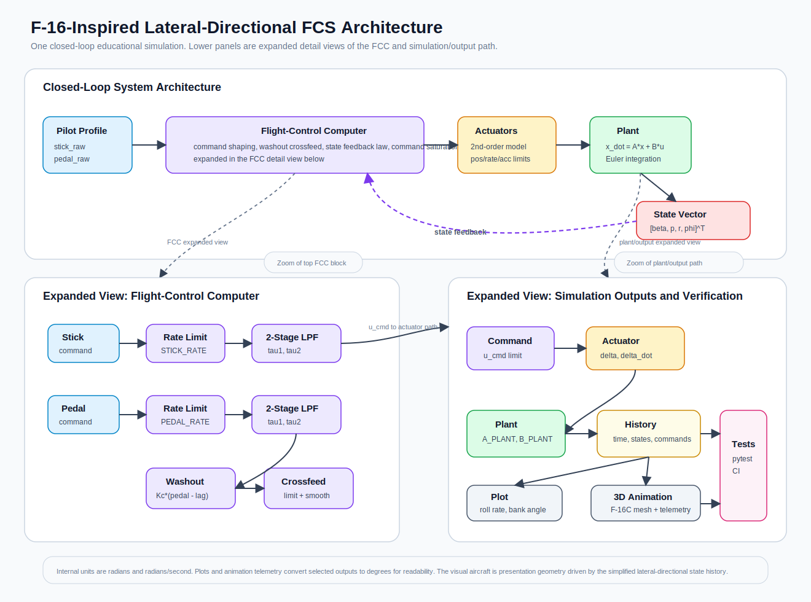

# F-16-Inspired Lateral-Directional Flight Control Simulation

[](https://github.com/hunkarsuci/F16-Inspired-Lateral-Directional-FCS/actions/workflows/ci.yml)
[](https://github.com/hunkarsuci/F16-Inspired-Lateral-Directional-FCS/actions/workflows/codeql.yml)
[](https://securityscorecards.dev/viewer/?uri=github.com/hunkarsuci/F16-Inspired-Lateral-Directional-FCS)
[](https://github.com/hunkarsuci/F16-Inspired-Lateral-Directional-FCS/releases)
[](LICENSE)
[](.github/workflows/ci.yml)
[](https://github.com/hunkarsuci/F16-Inspired-Lateral-Directional-FCS/commits)
[](https://github.com/hunkarsuci/F16-Inspired-Lateral-Directional-FCS/issues)
[](https://github.com/hunkarsuci/F16-Inspired-Lateral-Directional-FCS/pulls)
[](.github/dependabot.yml)

A modular Python simulation of a simplified lateral-directional flight-control system inspired by F-16 control-system architecture.

The project demonstrates command shaping, state-feedback control, second-order actuator dynamics, actuator saturation, closed-loop response analysis, pytest coverage, CI, security scanning, and a generated 3D attitude animation.

> Educational and portfolio project only. This is not a certified flight-control system and must not be used for real aircraft operation, safety-critical control, or deployment.

## Features

- Linear lateral-directional aircraft plant
- Pilot stick and pedal command inputs
- Rate limiting and two-stage command filtering
- Washout-style pedal crossfeed path
- State-feedback control law
- Two-channel second-order actuator model
- Position, rate, and acceleration saturation
- Closed-loop roll-rate and bank-angle plotting
- F-16-inspired 3D aircraft attitude GIF with flight path, vapor trails, afterburner effect, and telemetry
- Parameter and input validation for simulation components
- Pytest suite and GitHub Actions CI
- CodeQL security analysis, OpenSSF Scorecard, and Dependabot configuration

## Architecture



The diagram shows one closed-loop system architecture with expanded detail views for the flight-control computer and the simulation/output path. It is maintained as a versioned SVG asset so the README renders consistently without depending on Mermaid support.

## Model

The plant uses the linear state-space form:

```text
x_dot = A*x + B*u
x = [beta, p, r, phi]^T
u = [u1, u2]^T
```

The included coefficients are representative teaching values for lateral-directional dynamics, not a full nonlinear F-16 model. States are kept in radians and radians per second internally; plots convert roll rate and bank angle to degrees for readability.

The actuator model is:

```text
delta_ddot = -2*zeta*w0*delta_dot - w0^2*delta + w0^2*u_cmd
```

Each actuator channel enforces configured acceleration, rate, and position limits before passing deflection into the plant.

## Run

```bash
pip install -r requirements.txt
python scripts/run_demo.py
```

By default, the demo simulates 30 seconds of closed-loop response with pilot stick and pedal inputs distributed across the full run. Shorter runs can still be requested from Python with `run_simulation(duration=...)` for quick experiments or tests.

The demo writes:

```text
outputs/f16_2nd_order_actuator.png
outputs/f16_attitude_3d.gif
```

The animation is an engineering visualization driven by the simulated lateral-directional states. It uses an F-16-inspired visual mesh for presentation quality, while the underlying model remains the simplified educational plant described above.

The default animation uses `aircraft_model="f16c"`, a closer F-16C-inspired procedural mesh with single-engine nozzle, swept wings, stabilators, ventral fins, and wingtip rails. A second `aircraft_model="concept"` option is available for a more futuristic showcase style.

## Test

```bash
pytest -q
```

The tests cover actuator limits, command shaping, controller saturation and validation, finite simulation outputs, and 3D animation generation.

## Repository Structure

```text
.github/
  dependabot.yml
  workflows/
    ci.yml
    codeql.yml
    release.yml
    scorecard.yml
architecture/
  system_architecture.svg
scripts/
  run_demo.py
src/
  actuators.py
  command_shaping.py
  controller.py
  params.py
  plant.py
  simulate.py
  visualization.py
tests/
  test_actuator_limits.py
  test_command_shaping.py
  test_controller.py
  test_simulation_outputs.py
```

## Scope

Implemented:

- Simplified linear plant
- Stick and pedal command shaping
- Washout-style crossfeed
- State-feedback controller
- Saturated second-order actuator dynamics
- Closed-loop simulation history export
- Roll-rate and bank-angle plot
- 3D attitude animation
- Unit tests, CI, CodeQL, OpenSSF Scorecard, and Dependabot

Not implemented:

- Full nonlinear F-16 flight dynamics
- Trim solver
- Gain scheduling
- Sensor models
- Atmospheric turbulence
- Pilot-in-the-loop interface
- Certification-level verification and validation

## Disclaimer

This repository is not affiliated with Lockheed Martin, General Dynamics, the United States Air Force, or any official F-16 program. It is a simplified educational control-system demonstration.

## License

MIT License. See [LICENSE](LICENSE).
